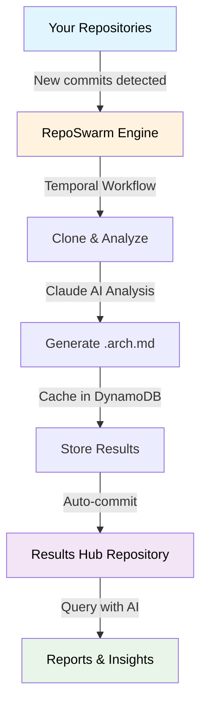

# 🤖 RepoSwarm

<p align="center">
  
</p>

<p align="center">
  <strong>AI-powered multi-repo architecture discovery platform</strong>
</p>

<p align="center">
  <a href="https://github.com/reposwarm/reposwarm/blob/main/LICENSE"></a>
  <a href="https://www.python.org/downloads/"></a>
  <a href="https://www.youtube.com/watch?v=rOMf9xvpgtc"></a>
</p>

<p align="center">
  <a href="#quick-start">Quick Start</a> •
  <a href="#how-it-works">How It Works</a> •
  <a href="#configuration">Configuration</a> •
  <a href="#related-projects">Ecosystem</a> •
  <a href="#contributing">Contributing</a>
</p>

> **📦 Previously `loki-bedlam/repo-swarm`. Moved to the [RepoSwarm organization](https://github.com/reposwarm). Old URLs redirect automatically.**

---

## What is RepoSwarm?

RepoSwarm is an intelligent agentic engine that **automatically analyzes your entire codebase portfolio** and generates standardized architecture documentation. Point it at your GitHub repos and get back clean, structured `.arch.md` files — perfect as AI agent context, onboarding docs, or architecture reviews.

<p align="center">
  
</p>

### ✨ Key Features

- 🔍 **AI-Powered Analysis** — Uses Claude Code SDK to deeply understand codebases
- 📝 **Standardized Output** — Generates consistent `.arch.md` architecture files
- 🔄 **Incremental Updates** — Daily Temporal workflows only re-analyze repos with new commits
- 💾 **Smart Caching** — DynamoDB or file-based caching avoids redundant analysis
- 🎯 **Type-Aware Prompts** — Specialized analysis for backend, frontend, mobile, infra, and libraries
- 📦 **Results Hub** — All architecture docs committed to a centralized results repository

### 📋 See It In Action

Check out [RepoSwarm's self-analysis report](https://github.com/royosherove/repo-swarm-sample-results-hub/blob/main/repo-swarm.arch.md) — RepoSwarm investigating its own codebase!

🎬 **Architecture Overview (click to play)**

[](https://www.youtube.com/watch?v=rOMf9xvpgtc)

---

## How It Works



**Workflow Pipeline:**

1. **Cache Check** → Query DynamoDB to see if repo was already analyzed
2. **Clone** → Clone the repository to temporary storage
3. **Type Detection** → Determine if it's backend, frontend, mobile, etc.
4. **Structure Analysis** → Build a tree of files and directories
5. **Prompt Selection** → Choose analysis prompts based on repo type
6. **AI Analysis** → Send prompts + code context to Claude
7. **Result Storage** → Save results and generate markdown files
8. **Cleanup** → Remove temporary files

---

## Quick Start

### Prerequisites

- Python 3.12+
- Claude API key

### Installation

```bash
# Install mise (tool version manager)
brew install mise        # macOS
# or: curl https://mise.run | sh   # Linux/WSL

# Clone and setup
git clone https://github.com/reposwarm/reposwarm.git
cd reposwarm

# 🚀 Interactive setup wizard (recommended)
mise get-started
```

The wizard configures your Claude API key, GitHub integration, and architecture hub repository.

<details>
<summary><strong>Manual setup</strong></summary>

```bash
cp env.local.example .env.local
# Edit .env.local with your ANTHROPIC_API_KEY
mise install
mise run dev-dependencies
```
</details>

### Running

```bash
# Analyze all configured repositories
mise investigate-all

# Analyze a single repository
mise investigate-one https://github.com/user/repo
```

---

## Configuration

### Adding Repositories

Edit `prompts/repos.json`:

```json
{
  "repositories": {
    "my-backend": {
      "url": "https://github.com/org/my-backend",
      "type": "backend",
      "description": "Main API service"
    },
    "my-frontend": {
      "url": "https://github.com/org/my-frontend",
      "type": "frontend",
      "description": "React web app"
    }
  }
}
```

### Analysis Prompt Types

| Type | Focus | Prompts |
|------|-------|---------|
| 🔧 **Backend** | APIs, databases, services | [`prompts/backend/`](prompts/backend/) |
| 🎨 **Frontend** | Components, routing, state | [`prompts/frontend/`](prompts/frontend/) |
| 📱 **Mobile** | UI, device features, offline | [`prompts/mobile/`](prompts/mobile/) |
| 📚 **Libraries** | API surface, internals | [`prompts/libraries/`](prompts/libraries/) |
| ☁️ **Infrastructure** | Resources, deployments | [`prompts/infra-as-code/`](prompts/infra-as-code/) |
| 🔗 **Shared** | Security, auth, monitoring | [`prompts/shared/`](prompts/shared/) |

---

## Mise Tasks

<details>
<summary><strong>Development</strong></summary>

```bash
mise dev-server          # Start Temporal server
mise dev-dependencies    # Install Python dependencies
mise dev-worker          # Start Temporal worker
mise dev-client          # Run workflow client
mise kill                # Stop all Temporal processes
mise dev-repos-list      # List available repositories
mise dev-repos-update    # Update repository list from GitHub
```
</details>

<details>
<summary><strong>Investigation</strong></summary>

```bash
mise investigate-all     # Analyze all repositories locally
mise investigate-one     # Analyze single repository locally
mise investigate-public  # Analyze public repository
mise investigate-debug   # Analyze with detailed logging
```
</details>

<details>
<summary><strong>Testing</strong></summary>

```bash
mise verify-config       # Validate configuration
mise test-all            # Run complete test suite
mise test-units          # Run unit tests only
mise test-integration    # Run integration tests
mise test-dynamodb       # Test DynamoDB functionality
```
</details>

<details>
<summary><strong>Docker</strong></summary>

```bash
mise docker-dev          # Build and run for development
mise docker-debug        # Debug with verbose logging
mise docker-test-build   # Test Docker build process
```
</details>

---

## Project Structure

```
reposwarm/
├── prompts/                 # AI analysis prompts by repo type
│   ├── backend/            # API, database, service prompts
│   ├── frontend/           # UI, component, routing prompts
│   ├── mobile/             # Mobile app specific prompts
│   ├── libraries/          # Library/API prompts
│   ├── infra-as-code/      # Infrastructure prompts
│   ├── shared/             # Cross-cutting concerns
│   └── repos.json          # Repository configuration
├── src/
│   ├── investigator/       # Core analysis engine
│   │   └── core/          # Main analysis logic
│   ├── workflows/          # Temporal workflow definitions
│   ├── activities/         # Temporal activity implementations
│   ├── models/             # Data models and schemas
│   └── utils/              # Storage adapters and utilities
├── tests/                  # Unit and integration tests
└── temp/                   # Generated .arch.md files (local dev)
```

---

## Production Deployment

RepoSwarm uses [Temporal](https://temporal.io/) for reliable workflow orchestration.

```bash
# Start Temporal server
mise dev-server

# Run worker (connects to Temporal)
TEMPORAL_SERVER_URL=your-server:7233 mise dev-worker

# Trigger investigation
mise dev-client

# Monitor
mise monitor-workflow investigate-repos-workflow
```

<details>
<summary><strong>Programmatic client integration</strong></summary>

```python
from temporalio.client import Client

async def trigger_investigation():
    client = await Client.connect("your-temporal-server:7233")
    await client.execute_workflow(
        "investigate_repos_workflow",
        args=["repo-url"],
        id="workflow-id",
        task_queue="investigation-queue"
    )
```
</details>

---

## Related Projects

| Project | Description |
|---------|-------------|
| 📊 [**reposwarm-ui**](https://github.com/reposwarm/reposwarm-ui) | Next.js dashboard for browsing investigations |
| 🔌 [**reposwarm-api**](https://github.com/reposwarm/reposwarm-api) | REST API server for repos, workflows, prompts |
| ⌨️ [**reposwarm-cli**](https://github.com/reposwarm/reposwarm-cli) | CLI tool for humans and AI agents |
| 📋 [**sample-results-hub**](https://github.com/royosherove/repo-swarm-sample-results-hub) | Example output — generated `.arch.md` files |

---

## Credits

RepoSwarm was born out of a hackathon at [Verbit](https://verbit.ai/), built by:
- [Moshe](https://github.com/mosher)
- [Idan](https://github.com/Idandos)  
- [Roy](https://github.com/royosherove)

---

## Contributing

1. Fork the repository
2. Create a feature branch
3. Make changes and add tests
4. Run `mise test-all`
5. Submit a pull request

---

## License

This project is licensed under the [Polyform Noncommercial License 1.0.0](LICENSE).
You may use, copy, and modify the code for non-commercial purposes only.
For commercial licensing, contact roy at osherove dot com.
